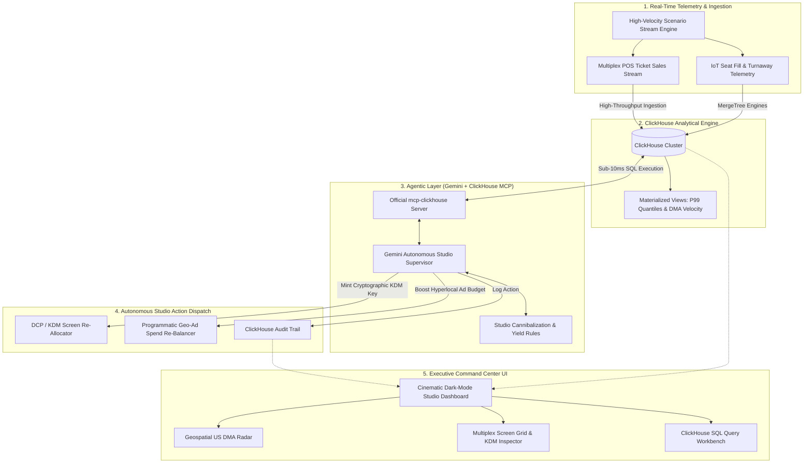

# 🎬 BoxOffice Pulse
### *Real-Time Cinema Audience Telemetry & Autonomous Screen Re-Allocator*

[](https://opensource.org/licenses/MIT)
[](https://agentic-cinema.devpost.com/)
[](https://cloud.google.com/)

> **Agentic Cinema: The Blockbuster Hackathon Submission**  
> **Partner Track:** ClickHouse  
> **OSI License:** MIT License ([`LICENSE`](./LICENSE))  
> **Live Deployment:** [https://auhuman.github.io/BoxOfficePulse/](https://auhuman.github.io/BoxOfficePulse/)  

---

## 📽️ Executive Summary & Problem

During opening weekends, movie studios and cinema multiplex chains (AMC, Regal, Alamo Drafthouse, Cinemark) lose **millions of dollars in uncaptured revenue** due to static screen allocations:
1. **The Blockbuster Bottleneck**: Surging films (e.g. *Neon Odyssey: 2099*) hit **99%+ sellout rates**, turning away hundreds of eager moviegoers per hour.
2. **The Flop Drag**: Adjacent auditoriums screening underperforming titles run at **12–18% seat occupancy**, burning electricity and empty seat-hours.
3. **Day-Late Batch Data**: Studio distribution executives traditionally make screen scheduling decisions on **day-late batch figures**, missing the critical 48-hour opening window.

**BoxOffice Pulse** solves this with **ClickHouse** and an autonomous **Gemini Enterprise Supervisor Agent**. High-frequency ticketing velocity and seat-fill telemetry are ingested directly into ClickHouse. When an under-screened theater or surging market is detected via ClickHouse MCP tools, the agent autonomously:
1. Calculates **P99 quantile seat occupancy** across DMAs using ClickHouse analytical queries.
2. Identifies cannibalization candidate screens with low occupancy.
3. Generates and mints **SMPTE-compliant Digital Cinema Package (DCP) Key Delivery Messages (KDM)** to instantly unlock the blockbuster on new screens.
4. Dynamically re-balances **programmatic digital ad spend** (Meta/TikTok/Google Ads) in the surging zip code.
5. Records full audit logs back into ClickHouse.

---

## 🏛️ System Architecture



---

## ⚡ Active Runtime Partner Usage: ClickHouse

BoxOffice Pulse integrates **ClickHouse** at runtime in two complementary modes:

### 1. Official ClickHouse MCP Server (`mcp-clickhouse`)
The Gemini Autonomous Supervisor interacts with ClickHouse through structured MCP tool calls:
- `clickhouse_execute_query`: Runs arbitrary analytical SQL statements with millisecond latency.
- `clickhouse_get_p99_fill_rates`: Executes weighted quantile functions (`quantileExact(0.99)(fill_rate_pct)`) across active theaters.
- `clickhouse_detect_screen_cannibalization_targets`: Filters `dcp_screen_allocations` to find under-utilized screens (`fill_rate <= 35.0%`).
- `clickhouse_get_revenue_attribution_delta`: Computes projected revenue uplift from swapping screens and boosting local ad spend.

### 2. High-Performance ClickHouse DDL & Materialized Views
Located in [`src/lib/clickhouse/schema.sql`](./src/lib/clickhouse/schema.sql):
- **`ticket_sales_stream`**: `MergeTree()` table partitioned by day with TTL for high-velocity POS sales ingestion.
- **`dcp_screen_allocations`**: `ReplacingMergeTree()` tracking real-time auditorium status, film formats (IMAX 70mm, Dolby, Laser 4K), and KDM license keys.
- **`mv_dma_fill_rate_quantiles`**: `SummingMergeTree()` Materialized View computing real-time P95/P99 quantiles per DMA.

---

## 🚀 Key Features

- **🌍 Geospatial US DMA Radar Map**: Real-time visualization of 50+ cinema nodes with pulsing surge indicators, occupancy meters, and DMA interconnects.
- **🎟️ Multiplex Screen Allocation Matrix**: Live auditorium cards with movie posters, format badges (IMAX/Dolby/4K), fill rates, and dynamic screen swap animations.
- **🤖 Autonomous Agent Reasoning Feed**: Transparent step-by-step trace showing agent hypothesis formulation, dispatched ClickHouse SQL queries, execution latency, and dispatched studio actions.
- **📊 ClickHouse SQL Query Workbench**: Interactive SQL query runner with pre-built queries, instant tabular results, row count stats, and query execution benchmarks.
- **🔐 SMPTE-Compliant KDM Certificate Viewer**: Inspect cryptographic Key Delivery Messages with AES-128 GCM keys and validity windows minted by the autonomous agent.
- **💰 Real-Time Revenue Yield Counter**: Live counter tracking reclaimed lost box office revenue.

---

## 🎯 Demonstration Scenarios

1. **Midnight Blockbuster Frenzy**: Opening night sellouts in Austin & SoCal for *Neon Odyssey: 2099*. Agent detects P99 fill rate = 99.2%, cannibalizes Screen 4 (underperforming indie drama), mints KDM license, and reclaims +$27,560.
2. **Indie Screen Swap & Yield Max**: Midweek screening of *The Silent Meadow* running at 14% fill rate in LA. Agent swaps screen to high-margin sci-fi.
3. **Viral TikTok Campaign Surge**: Viral social media spike in NYC & Atlanta. Agent rebalances screen capacity and deploys +$4,500 programmatic ad budget in target zip code.

---

## 🛠️ Quickstart & Local Setup

```bash
# 1. Clone the repository
git clone https://github.com/auhuman/BoxOfficePulse.git
cd BoxOfficePulse

# 2. Install dependencies
npm install

# 3. (Optional) Configure ClickHouse Cloud in .env
cp .env.example .env
# Set VITE_CLICKHOUSE_HOST and VITE_CLICKHOUSE_PASSWORD if connecting to ClickHouse Cloud.
# If left unset, the app runs in High-Fidelity Embedded ClickHouse Engine mode out of the box!

# 4. Start local development server
npm run dev
```

Visit `http://localhost:5173` to explore the Studio Operations Command Center.

---

## 📹 3-Minute Demo Video Script

| Timestamp | Section | Visual & Narrative Focus |
|---|---|---|
| **0:00 - 0:30** | **The Problem** | Explain the $100M+ opening weekend theater allocation problem and why day-late batch numbers cause empty auditoriums and turnaways. |
| **0:30 - 1:15** | **Live Telemetry & ClickHouse** | Show high-throughput POS stream ingestion into ClickHouse; run P99 quantile query in the interactive SQL workbench showing <3ms execution. |
| **1:15 - 2:15** | **Autonomous Agent in Action** | Trigger the "Midnight Blockbuster Frenzy" scenario. Watch Gemini chain ClickHouse MCP tools, diagnose Austin Alamo Drafthouse sellouts, cannibalize Screen 4, and mint the SMPTE KDM license. |
| **2:15 - 2:45** | **KDM Certificate & Ad Spend Boost** | Open the KDM modal to inspect the cryptographic certificate; review the $4,500 programmatic ad spend shift. |
| **2:45 - 3:00** | **Architecture & Impact** | Highlight ClickHouse MergeTree engine, official MCP server integration, and enterprise studio ROI. |

---

## 📜 License

This project is open source and available under the [MIT License](./LICENSE).
